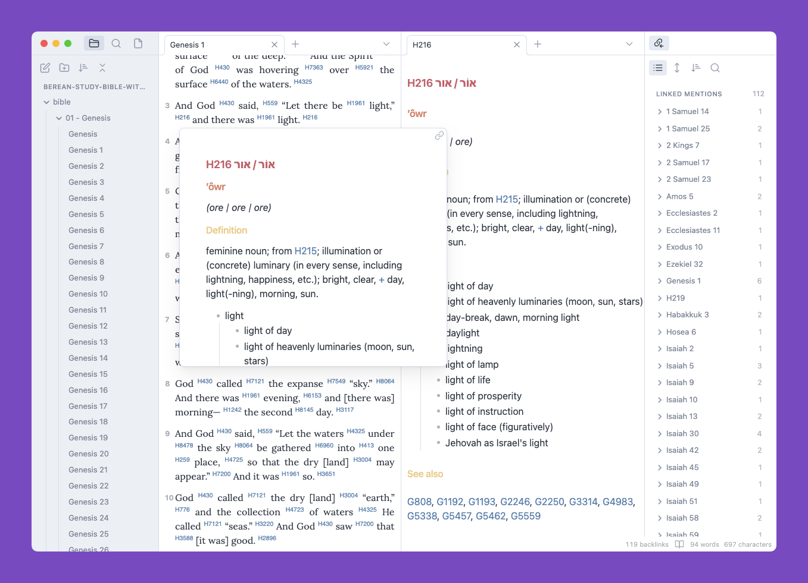
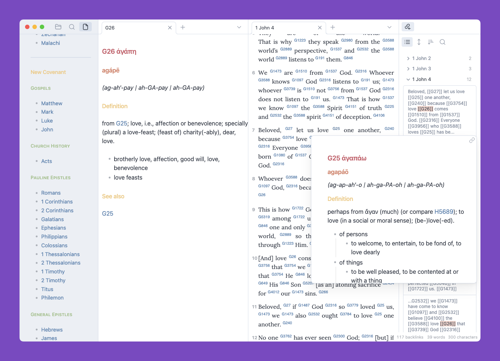
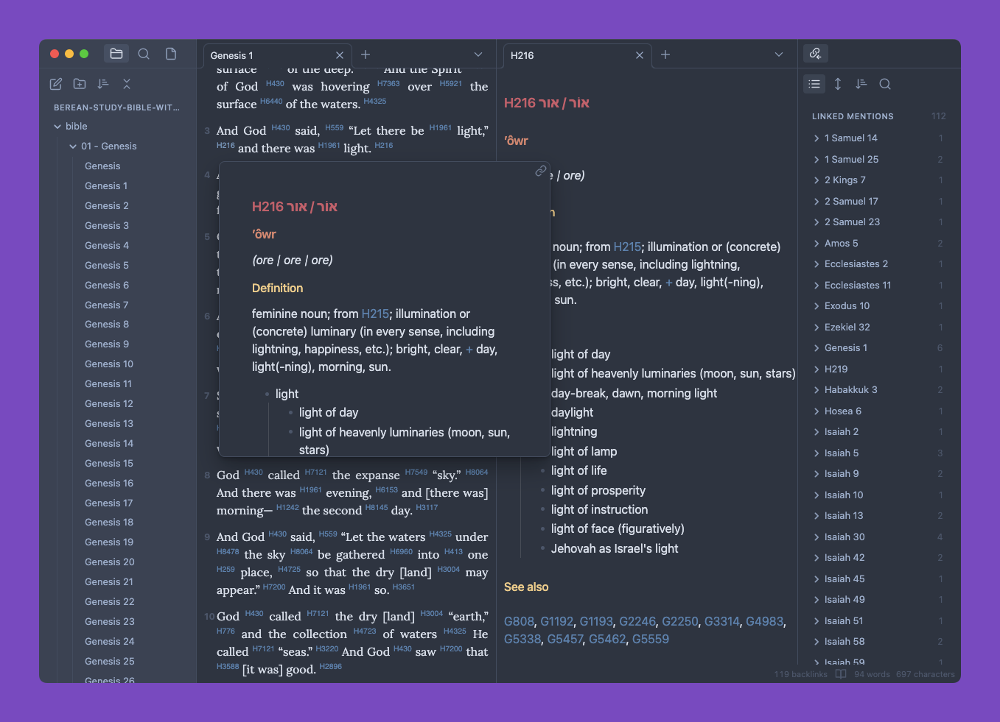
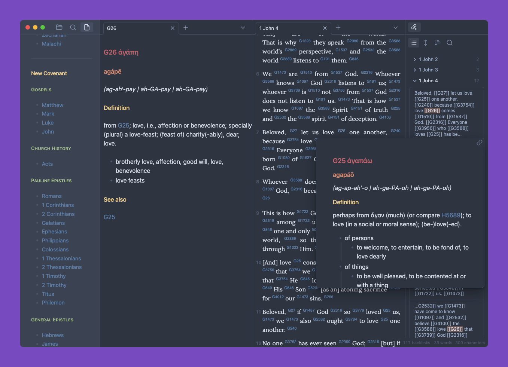

# Berean Study Bible with Strongs

Markdown-based Bible with Strongs Hebrew & Greek definitions, created for the [Obsidian](https://obsidian.md) knowledge base application.

---

> The Berean Bible is a completely new English translation of the Holy Bible, effective for public reading, study, memorization, and evangelism. Inspired by the words in the Book of Acts, and based on the best available manuscripts and sources, each word is connected back to the Greek or Hebrew text to produce a transparent text that can be studied for its root meanings.
> 
> [About the Berean Bible](https://bereanbibles.com/about-berean-study-bible/)

Special thanks to [@Oblique82](https://github.com/Oblique82) for his help sponsoring and refining this project.

## Installation

1. Download [latest release](https://github.com/gapmiss/berean-study-bible-with-strongs/releases/latest)
2. Extract archive
3. Choose "Open as Folder" from within Obsidian (File → Open Vault...).

## Screenshots

### Minimal theme — light mode





### Minimal theme — dark mode





## Example custom CSS

```css
/*******
* 
* strongs numbers w/in passages
* 
*******/
.lexicon a[data-href^="H0"],
.lexicon a[data-href^="H1"],
.lexicon a[data-href^="H2"],
.lexicon a[data-href^="H3"],
.lexicon a[data-href^="H4"],
.lexicon a[data-href^="H5"],
.lexicon a[data-href^="H6"],
.lexicon a[data-href^="H7"],
.lexicon a[data-href^="H8"],
.lexicon a[data-href^="H9"],
.lexicon a[data-href^="G0"],
.lexicon a[data-href^="G1"],
.lexicon a[data-href^="G2"],
.lexicon a[data-href^="G3"],
.lexicon a[data-href^="G4"],
.lexicon a[data-href^="G5"],
.lexicon a[data-href^="G6"],
.lexicon a[data-href^="G7"],
.lexicon a[data-href^="G8"],
.lexicon a[data-href^="G9"] {
  font-size:.65em;
  vertical-align:super;
  text-decoration: none !important;
  font-family:sans-serif !important;
  /*opacity:77%;*/
  /*font-weight:bold !important;*/
}
/*******
* 
* passage paragraphs
* 
*******/
.lexicon p {
  text-indent: 7px;
  padding-left:20px;
  padding-right:10px;
  text-align: justify;
  font-family:Lora !important;
  padding-top:0px !important;
  margin-top: 0px !important;
}
/*******
* 
* verse numbers aligned
* to the left of verse
* 
*******/
.markdown-preview-view h6,
.cc-pretty-preview .markdown-preview-view h6 {
  position: relative;
  left: 0;
  top: 33px;
  line-height: 0px;
  margin-top: -20px;
  margin-right: 3px;
  font-family: var(--font-family-preview);
  font-weight: 500;
  font-size: .88em !important;
  font-weight: bold;
  font-style: normal;;
  color: var(--text-faint) !important;
}
/*******
* 
* verse numbers on
* hover preview popover
* 
*******/
div.popover.hover-popover .markdown-preview-view h6 {
  top: 23px;
}
```


---

> The Holy Bible, Berean Study Bible, BSB
> Copyright &copy; 2016, 2020 by Bible Hub
> [Used by Permission](https://berean.bible/terms.htm). All Rights Reserved Worldwide.